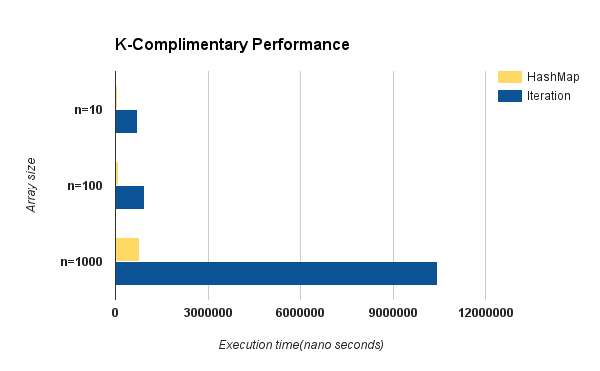

# My WalletHub   


## "Hello World"
I am Ajay Kavuri ([pseudoaj](www.pseudoaj.com)), I am a graduate student here at West Virginia University. The solutions for the programming assignment are presented here.

## Talk is cheap show me the code
All the code is hosted on github and here is the **link: [https://github.com/PseudoAj/MyWalletHub](https://github.com/PseudoAj/MyWalletHub).** Further, following section presents the important aspects of code, the snippets reflect my thought process and output for the respective problems is also presented.

## Tools I have used for the assignment
1. **Operating system:** Ubuntu 14.04
1. **Editor:** Atom
1. **Java:** 1.8.0_91
1. Junit4
1. White board and caffine


## Solutions
### 1. Java
#### 1.1 Palindrome
Palindrome can be checked using the following function:
```java
//method to check for Palindrome
public boolean isPalindrome(){
  //if it is null string it is false
  if (this.checkMeStr.length()>0){//handles null(replaced as empty) and empty strings
    return this.checkMeStr.equals(new StringBuilder(this.checkMeStr).reverse().toString());
  }
  return false;
}
```
Following test classes have been checked using JUnit:
1.
```java
 javac -cp .:/usr/share/java/junit4.jar PalindromeTest.java
```

```java
java -cp .:/usr/share/java/junit4.jar org.junit.runner.JUnitCore PalindromeTest
```

#### 1.2 K-Complimentary
Compiling:
```java
javac -cp /home/pseudoaj/Downloads/commons-collections4-4.1/commons-collections4-4.1.jar KComplimentary.java
```

Running:
```java
java -cp /home/pseudoaj/Downloads/commons-collections4-4.1/commons-collections4-4.1.jar:. KComplimentary
```
Performance:


